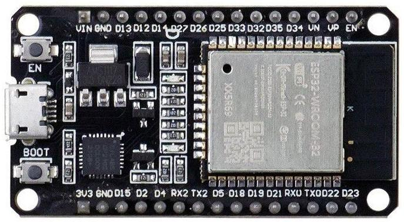
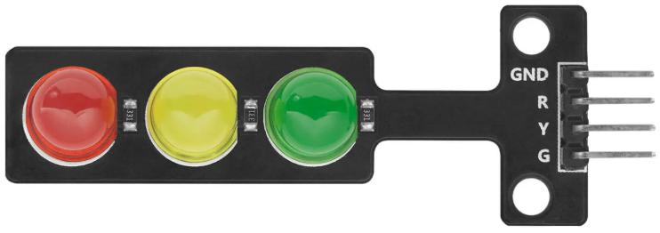
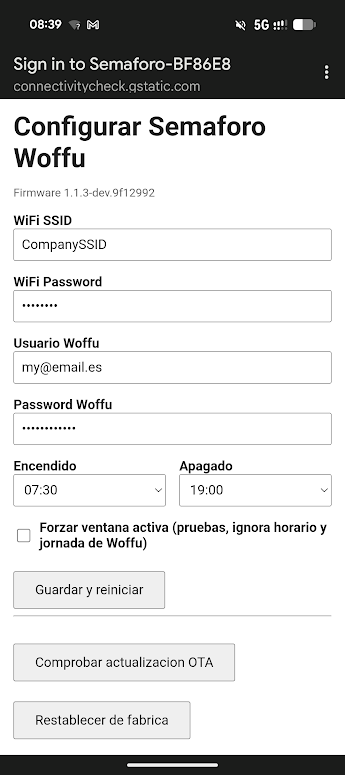

# Semáforo Woffu

Firmware para un dispositivo ESP32 que muestra visualmente el estado de fichaje de [Woffu](https://woffu.com/) mediante un semáforo LED: 🔴 no fichado, 🟢 fichado, 🟡 estado desconocido. Opcionalmente permite fichar/desfichar acercando una tarjeta NFC (lector PN532), o automáticamente según un horario configurable por día laborable.

## Hardware

| ESP32 (ELEGOO Type-C, DevKit genérico) | Módulo semáforo LED (R/Y/G) |
|---|---|
|  |  |

### Conexión

El módulo de semáforo tiene 4 pines (GND, R, Y, G; cátodo común, se encienden en activo-alto) que se conectan directamente a GPIOs del ESP32 — no hace falta resistencia externa, el módulo ya la lleva integrada:

| Módulo semáforo | ESP32 |
|---|---|
| GND | GND |
| R | GPIO25 |
| Y | GPIO26 |
| G | GPIO27 |

Los LEDs se manejan como GPIO digitales on/off (sin PWM): el brillo es fijo al máximo y no es configurable.

### NFC (opcional)

Lector PN532 por SPI (bus VSPI), para fichar/desfichar acercando una tarjeta:

| Módulo PN532 (modo SPI) | ESP32 |
|---|---|
| SCK | GPIO18 |
| MISO | GPIO19 |
| MOSI | GPIO23 |
| SS/CS | GPIO5 |

Los breakouts PN532 suelen tener un jumper/switch para elegir el modo (HSU/I2C/SPI) — confirmar que está en modo SPI. Si el lector no se detecta, el firmware sigue funcionando con normalidad, solo sin fichaje por NFC (ver `Arquitectura.md`).

## Funcionamiento

- **En cada arranque** (esté o no configurado el dispositivo): antes de abrir el portal intenta conectar a la WiFi guardada, sincronizar la hora y comprobar actualizaciones OTA (LEDs rotando verde→amarillo→rojo cada 1s mientras tanto, como indicador de "cargando"; hasta 20s de margen, o menos si todo va bien). Hecho eso (o agotado el margen), entra en `PORTAL_WINDOW`: si la WiFi llegó a conectar, dura 30s (o hasta que se desconecte el cliente) antes de pasar a modo normal, para poder reconfigurar o comprobar/instalar actualizaciones OTA sin necesidad de resetear de fábrica; si no llegó a conectar (primer arranque, tras un "Restablecer de fábrica", o credenciales incorrectas), el portal se queda abierto indefinidamente, porque no tiene sentido pasar a modo normal sin WiFi ni portal.
- **Modo normal (`RUNNING`)**: el portal se apaga, se conecta a la WiFi configurada, se sincroniza la hora (NTP + zona horaria por geolocalización IP) y arranca el sondeo a Woffu (LEDs rotando verde→amarillo→rojo mientras tanto, para no confundir esa espera con estar apagado por horario). El `Scheduler` decide si el dispositivo está encendido: **off** (LEDs apagados) fuera del horario configurado o en fin de semana/festivo según Woffu, **activo** (sondeo cada 60s) el resto del tiempo dentro del horario configurado.
- El estado que devuelve Woffu se traduce directamente a color: 🔴 no fichado, 🟢 fichado, 🟡 desconocido (fallo de red o de la API, sin reintentos adicionales — se reintenta en el siguiente ciclo de polling). El amarillo tiene dos variantes según si el fallo depende o no de la configuración introducida por el usuario:
  - **Amarillo fijo** — fallo puntual que no depende de la configuración (Woffu caído, error de red transitorio, etc.): se reintenta solo, sin más acción por parte del usuario.
  - **Amarillo parpadeando** — fallo persistente que sí depende de la configuración y requiere revisarla desde el portal: no se ha podido conectar a la WiFi configurada (SSID/password incorrectos), o Woffu rechaza el usuario/password configurados.
- Las actualizaciones OTA se comprueban solas en cuanto el dispositivo tiene WiFi y hora sincronizada (sin depender de que nadie abra la página del portal): la página muestra si el firmware está al día o si hay una versión nueva, y en ese caso ofrece un botón para instalarla. El pipeline de CI publica una nueva versión en GitHub Releases automáticamente al hacer push a `main`.
- **Fichaje por NFC** (si hay una tarjeta aprendida, ver `## Configuración`): mientras el dispositivo está encendido (no con el semáforo apagado), el lector NFC escucha continuamente. Al acercar una tarjeta los LEDs rotan rápido; si el UID no coincide con la aprendida, el rojo parpadea rápido unos segundos; si coincide, el verde parpadea rápido y se llama a la API de Woffu para fichar o desfichar (según el último estado conocido) — si esa llamada falla, el ámbar parpadea rápido en su lugar. Hay que retirar la tarjeta antes de que un nuevo tap se procese de nuevo.
- **Fichaje automático por horario** (deshabilitado por defecto, ver `## Configuración`): si está activo, al llegar la hora de entrada configurada de un día laborable se ficha automáticamente (si no se estaba fichado ya), y a la de salida se desficha (si se estaba fichado) — comprobando siempre el estado real y actualizado en Woffu justo antes de fichar, para no fichar dos veces y acabar en el sentido contrario al esperado. Si Woffu marca el día como festivo o fin de semana, ese día se omite.

## Configuración

Al arrancar sin datos guardados (o tras un "Restablecer de fábrica"), el dispositivo abre un portal cautivo WiFi (red `Semaforo-XXXXXX`) con un formulario de configuración accesible desde el móvil:



- **WiFi SSID / WiFi Password** — red WiFi a la que se conecta el dispositivo en modo normal. El campo SSID es un desplegable con las redes detectadas en un escaneo al abrir el portal, ordenadas de mayor a menor calidad de señal (se usa `<select>` en vez de un campo de texto con sugerencias porque el navegador cautivo que abren iOS/Android al conectarse al AP no soporta bien esto último).
- **Usuario Woffu / Password Woffu** — credenciales de la cuenta de Woffu cuyo estado de fichaje se consulta.
- **Encendido / Apagado** — franja horaria en la que el semáforo está activo y sondea Woffu; fuera de ella los LEDs se apagan (ver `Scheduler` en [Arquitectura.md](Arquitectura.md)).
- **Fichaje automático** — casilla para activarlo (desactivado por defecto) y, debajo, un horario de entrada/salida por cada día laborable (lunes 08:30-16:30... viernes 08:30-14:00 por defecto). Con la casilla activa, el dispositivo ficha/desficha solo a esas horas, comprobando antes el estado real en Woffu para no fichar dos veces.
- **Guardar y reiniciar** — persiste la configuración en NVS y reinicia en modo normal (`RUNNING`).
- La comprobación de actualización OTA es automática (si hay conexión); si hay una versión nueva disponible aparece un botón **Actualizar** para descargarla e instalarla. Mientras se instala, la página se va recargando sola mostrando el progreso.
- **Restablecer de fábrica** — borra la configuración guardada (incluida la tarjeta NFC aprendida) y reinicia, volviendo a abrir el portal.
- **Aprender tarjeta** (si hay un lector NFC conectado) — al pulsarlo los LEDs rotan rápido; acerca la tarjeta al lector para asociarla (sobrescribe la anterior si había una). No requiere reiniciar el dispositivo.

## Documentación

- [Requisitos.md](Requisitos.md) — alcance funcional, hardware, portal de configuración WiFi, OTA.
- [Arquitectura.md](Arquitectura.md) — máquina de estados, tareas, portal WiFi/NVS, cliente Woffu, OTA.
- [Plan.md](Plan.md) — plan de implementación: pasos hechos y pendientes.
- [tools/README.md](tools/README.md) — scripts auxiliares de desarrollo.

## Stack

- PlatformIO + framework Arduino (`arduino-esp32`).
- Librerías: WebServer y DNSServer (portal de configuración, incluidas en el core de `arduino-esp32`), HTTPClient/HTTPUpdate (API Woffu y OTA), Preferences (NVS), ArduinoJson, Adafruit PN532 + Adafruit BusIO (lector NFC por SPI).
- CI/CD: GitHub Actions + `semantic-release` (versionado y publicación de releases a partir de Conventional Commits).

## Ejemplo de log por serie

Primer arranque: se abre el portal de configuración, se detecta la zona horaria por geolocalización IP y se sincroniza la hora por NTP.

```
[+0s] Semaforo Woffu - firmware 1.1.3-dev.9f12992
[+0s] Ventana de portal de configuracion abierta (30s, o hasta que se desconecte el cliente).
[+0s] Portal WiFi: Semaforo-A1B2C3, password: 74019283 (192.168.4.1)
[+0s] WiFi conectado, IP: 192.168.22.24. Detectando zona horaria y sincronizando hora por NTP...
[+1s] Geolocalizacion IP: GET http://ip-api.com/json/?fields=status,message,offset,timezone,city,country -> 200
[+1s] Geolocalizacion IP: Valencia, Spain (Europe/Madrid), UTC+120 min
[+1s] Cliente conectado al portal de configuracion.
[08:39:01] Hora sincronizada por NTP.
[08:40:07] Cliente desconectado del portal de configuracion.
[08:40:07] Ventana de portal cerrada: se desconecto el ultimo cliente. Pasando a modo normal.
[08:40:07] Modo normal (RUNNING): portal apagado, conectando a la WiFi configurada.
[08:40:09] Woffu API: POST https://app.woffu.com/api/svc/accounts/authorization/token -> 200
[08:40:11] Woffu API: GET https://app.woffu.com/api/users -> 200
[08:40:13] Woffu API: GET https://app.woffu.com/api/svc/core/users/1234567/diarysummaries/workday -> 200
[08:40:13] Woffu: jornada de hoy - fin de semana=si, festivo=no.
[08:40:13] Cambio de ventana de polling: off (hoy es fin de semana segun Woffu)
```

Día laborable normal: el dispositivo arranca ya en modo `RUNNING` y sondea Woffu cada minuto mientras está dentro del horario configurado, hasta detectar el fichaje/desfichaje.

```
[+0s] Semaforo Woffu - firmware 1.1.3-dev.9f12992
[07:30:02] Modo normal (RUNNING): portal apagado, conectando a la WiFi configurada.
[07:30:04] Woffu API: POST https://app.woffu.com/api/svc/accounts/authorization/token -> 200
[07:30:06] Woffu API: GET https://app.woffu.com/api/users -> 200
[07:30:08] Woffu API: GET https://app.woffu.com/api/svc/core/users/1234567/diarysummaries/workday -> 200
[07:30:08] Woffu: jornada de hoy - fin de semana=no, festivo=no.
[07:30:08] Cambio de ventana de polling: activo (dentro de la ventana de encendido configurada)
[07:30:08] Woffu API: GET https://app.woffu.com/api/svc/signs/v2/signs/slots -> 200
[07:30:08] Estado Woffu: NO FICHADO (rojo)
...
[08:57:12] Woffu API: GET https://app.woffu.com/api/svc/signs/v2/signs/slots -> 200
[08:57:12] Estado Woffu: FICHADO (verde)
...
[18:00:08] Woffu API: GET https://app.woffu.com/api/svc/signs/v2/signs/slots -> 200
[18:00:08] Estado Woffu: FICHADO (verde)
[18:03:41] Woffu API: GET https://app.woffu.com/api/svc/signs/v2/signs/slots -> 200
[18:03:41] Estado Woffu: NO FICHADO (rojo)
```
